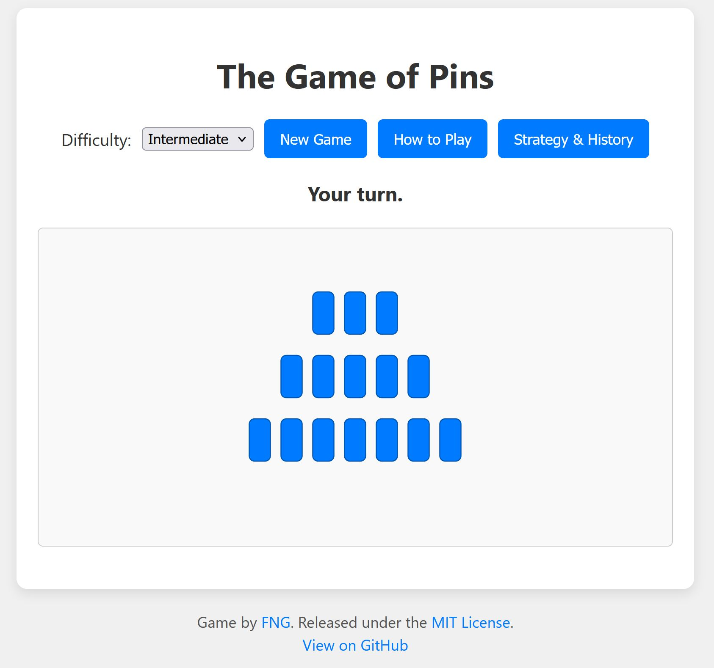

# The Game of Pins

A web-based implementation of a variation on the classic impartial game of Nim.

**[Play the live version here!](https://fngarvin.github.io/Pins/)**

 

## How to Play

The game board consists of three rows of pins. On your turn, you must remove one or more *contiguous* pins from a single row. The player who is forced to take the very last pin on the board loses the game.

-   **To make a move:** Click and drag to draw a selection box over any number of *contiguous* pins in a single row.
-   **The Goal:** Force your opponent to take the last pin.

For a deep dive into the winning strategy, open the game and click the "Rules & Strategy" button!

## Features

* Clean, responsive UI that works on desktop or mobile devices.
* Three AI difficulty levels: Novice, Intermediate, and Expert.
* A detailed "Rules & Strategy" guide that explains the mathematics of the game in a simple, visual way.
* A self-contained, single HTML file that can be played locally in a browser or hosted anywhere.

## License

This project is open-source and available under the **[MIT License](LICENSE)**.
